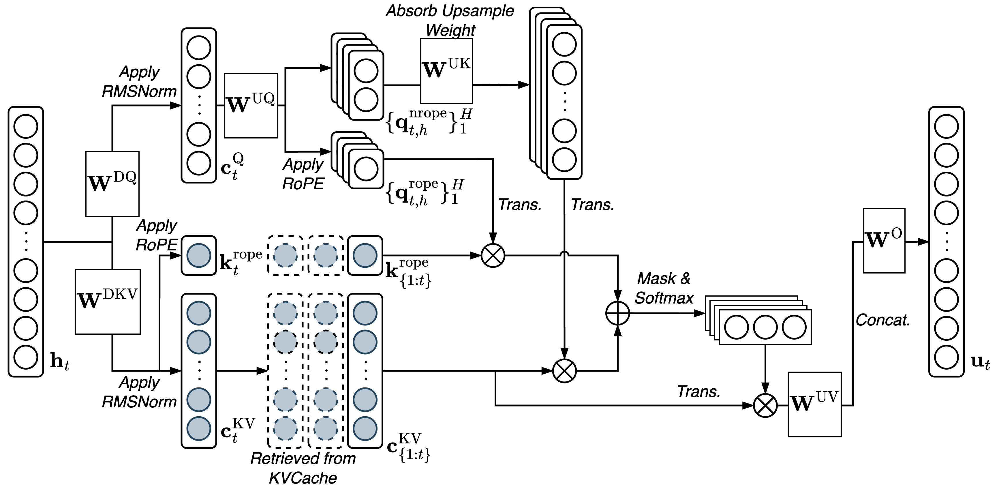

# ShallowMLA

An optimized PyTorch implementation of Multi-head Latent Attention (MLA) with Triton kernel fusion and paged KV cache management.

## Performance

- **73% throughput improvement** over a native PyTorch implementation baseline
- **90%+ memory reduction** with paged KV cache
- **30% additional speedup** from Triton optimized cache operations

## Key Features



### 1. Efficient MLA with Absorbed Weights
Following DeepSeek-V3, we absorb KV up-projection weights into query projections, eliminating redundant upsampling operations. The latent KV cache (`c^KV_t`, `k^r_t`) is stored in compressed form, reducing memory footprint while maintaining model capacity.

### 2. Triton Kernel Fusion
Custom fused kernels for critical operations:
- **Attention Score**: Fused non-RoPE and RoPE query-key multiplication (+46% gain)
- **Softmax**: Single-pass masked softmax with numerical stability (+9% gain)
- **RMSNorm**: Two-pass fused normalization and scaling
- **RoPE**: Direct complex rotation without tensor reshaping

### 3. Paged KV Cache Management
Dynamic page-based memory allocation (default 1024 tokens/page) with:
- Page table mapping from logical to physical memory
- On-demand allocation during inference
- Triton-optimized batched cache updates and retrievals

## Benchmarking

| Metric | Value |
|--------|-------|
| Throughput Gain | +73% |
| Memory Saving | 94% |
| Hardware | RTX 4090 / H200 |

## Citation

```bibtex
@misc{tan2025shallowmla,
  title={ShallowMLA: Optimizing Multi-head Latent Attention for Efficient Inference},
  author={Tan, Yike and Wang, Qingzheng and Wang, Xun},
  year={2025},
  howpublished={\url{https://github.com/Qingzheng-Wang/ShallowMLA}}
}
```

## Contributors

Yike Tan, Qingzheng Wang, Xun Wang

*Course Project for 11-868 Large Language Model Systems, Carnegie Mellon University, Spring 2025*
